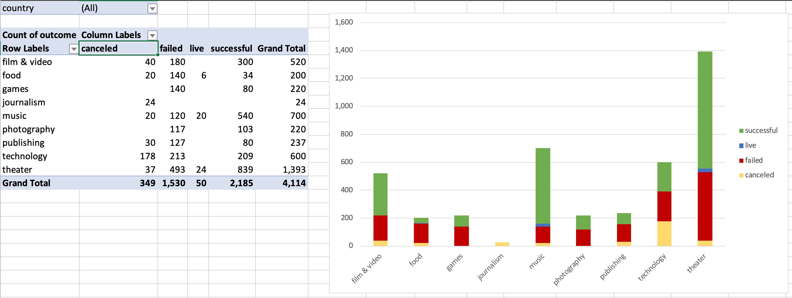
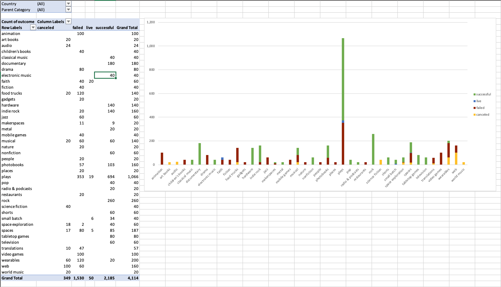
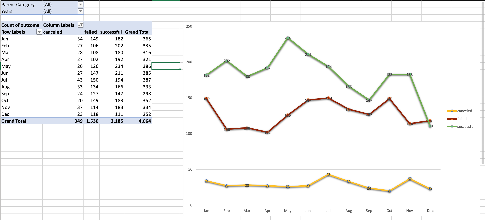
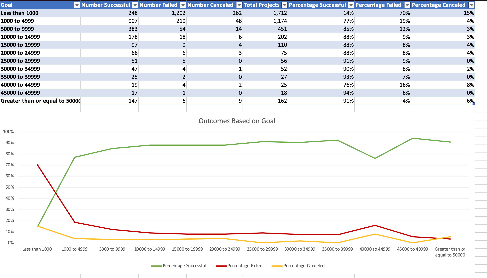

# Analysis of Kickstarter Campaigns

## Background

Over $2 billion has been raised using the massively successful crowdfunding service, Kickstarter, but not every project has found success. Of the more than 300,000 projects launched on Kickstarter, only a third have made it through the funding process with a positive outcome.

Getting funded on Kickstarter requires meeting or exceeding the project's initial goal, so many organizations spend months looking through past projects in an attempt to discover some trick for finding success. For this week's homework, you will organize and analyze a database of 4,000 past projects in order to uncover any hidden trends.

## Goal

Use `Excel` to modify and analyze the data of 4,000 past Kickstarter projects and attempt to uncover some market trends by examinging the outcomes of the campaigns and the campaign categories/sub-categories. 

## Data Analysis 

The conclusions I can draw from the provided data from Kickstarter campaigns are the following: 

* Overall, Kickstarter campaigns are more likely to succeed with a 53.8% success rate than fail with a 37.6% rate or get cancelled with an 8.6% rate.

### Outcomes by Category
* When performing an analysis by category, the campaigns in Music (79.4%) and Theater (61.3%) have the highest success rates and Food (17.5%) and Publishing (33.8%) have the lowest success rates. On the other hand, the categories with the highest cancellation rates were journalism with a 100% and Technology with a 29.7%.

### Outcomes by Sub-Categories

* When analyzing the campaigns **41 sub-categories**, there are **12 sub-categories with a 100% success rates**, which are rock music, documentary films & videos, hardware, tabletop games, short films & videos, television films & videos, non-fiction books, classical music, electronic music, pop music, metal music, and radio & podcasts. There are also campaign **13 sub-categories with 100% failure rates**, which are animation, video games, drama films & videos, faith music, jazz music, mobile games, children’s books, fiction books, restaurants, photography of nature, people and places, and technology gadgets. However, theater plays had the most number of Kickstarter campaigns (1,047) and the most number of successful campaigns (694).

### Outcomes by Launch Dates

* When analyzing the campaigns by launch dates, there is trend in decrease in the number successful campaigns during the summer months. Also, the number of successful and failed campaigns continue a downward trend until December when the failed count surpasses the success count. But when you review the categories in December you still find that Music is still the most successful with a success rate of 77%.

## Bonus

* A line chart that graphs the relationship between a goal's amount and its chances at success, failure, or cancellation.

## Limitations
The limitations I found with this dataset are the following:
1.	In order to provide a more thorough analysis for generating actionable insights we need a larger dataset since this dataset only includes 9 parent categories and 41 sub-categories.

2.	There is no data on if a successful campaign came to fruition or was the project actually completed; was the project successful in the real world and was a business started?

3.	Also, no specific locations are provided other than country. It would be great to have the city in which the campaigns originated to visualize success by part of the country (i.e. in the US it would be states and cities).

## Other Possible Tables and/or Graphs
The following additional tables and/or graphs can be created:
1.	A bar chart to display with number of days campaign ran and their outcome to determine if the length of the campaign affects its success rate.

2.	A pivot table using location and outcomes with a map chart visualizing by country the comparison of number of campaigns initiated in that country and their success rate.

##

- - -

© 2019
